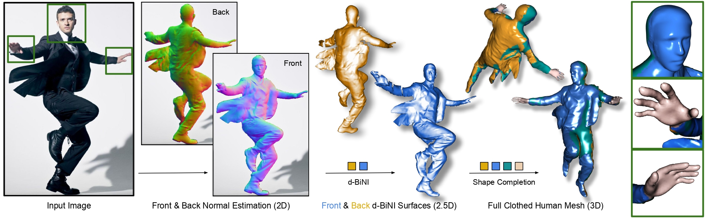
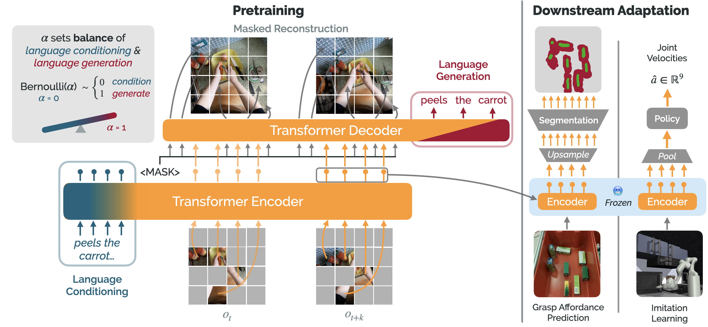

# Visualization for Research

## Algorithm
arXiv 2023, [Diffusion Policy: Visuomotor Policy Learning via Action Diffusion](https://diffusion-policy.cs.columbia.edu/)
<video src='https://github.com/YanjieZe/Visualization-for-Research/blob/main/videos/highlight_pusht_process.mp4' width=224/>

CVPR 2023, [ECON: Explicit Clothed humans Obtained from Normals](https://xiuyuliang.cn/econ/)

arXiv 2023, [Voltron: Language-Driven Representation Learning for Robotics](https://github.com/siddk/voltron-robotics)

